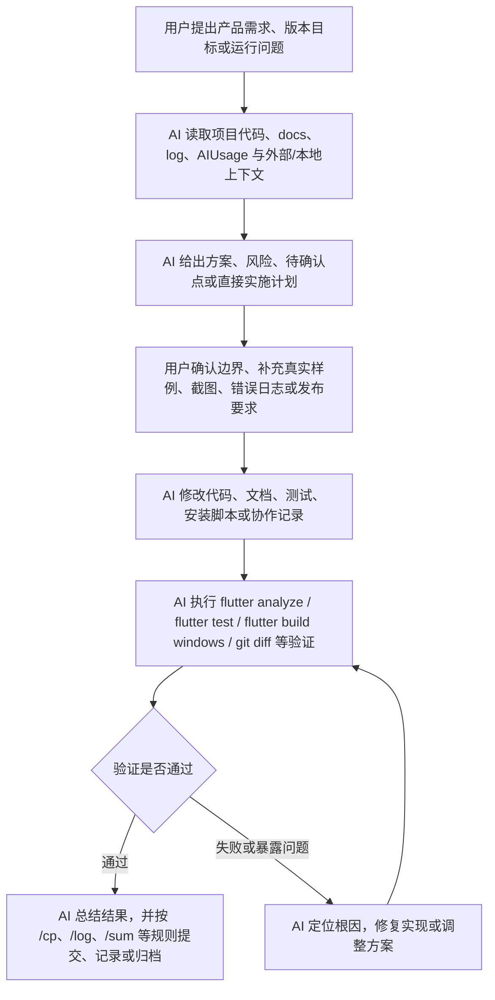

# SeekU AI协助过程总汇
Author: Tokiperson / 姚沛帆
Date: 2026-07-09
---

## 1. 汇总范围

本文件汇总 `AIUsage/` 目录下所有 AI 使用记录文档，覆盖 SeekU 从需求规划、v0.1alpha、v0.1beta、v0.1.0 snapshot/rc 到 v0.1.1 正式发布的主要 AI 协助过程。

| 来源文件 | 记录范围 | 记录性质 | 主统计处理 | 核心主题 |
| --- | --- | --- | --- | --- |
| `30-06-AIUsage.log` | 2026-06-30 | 早期旧格式记录 | 参考，不重复计数 | 目录初始化、需求分析、架构规划 |
| `30-06-AIUsage.md` | 2026-06-30 | 日记录 | 纳入 | 需求确认、技术路线、`/sum` 归档 |
| `01-07-AIUsage.md` | 2026-07-01 | 日记录 | 纳入 | v0.1alpha 实现、Windows 构建、GitHub 初始化、图标适配 |
| `03-07-AIUsage.md` | 2026-07-03 | 日记录 | 纳入 | v0.1beta、Excel/CSV 导入、UI 优化、接口预留 |
| `04-07-AIUsage.md` | 2026-07-04 | 日记录 | 纳入 | AI PDF/图片识别、Kimi/Moonshot 接入、API Key 规则、README/docs |
| `week2_AIUsage.md` | 2026-06-30 至 2026-07-05 | 周整合记录 | 参考，不重复计数 | week2 阶段性总览 |
| `07-07-AIUsage.md` | 2026-07-07 | 日记录 | 纳入 | rc.1、设置页、用户协议、Inno 打包、Release 准备 |
| `08-07-AIUsage.md` | 2026-07-08 | 日记录 | 纳入 | rc.2、首页逻辑、Openlib 自动匹配、文档同步 |
| `09-07-AIUsage.md` | 2026-07-09 | 日记录 | 纳入 | Windows 原生启动动画、v0.1.1 正式发布 |

主统计中不重复纳入的日记录共 7 份，提炼对话轮次共 86 条。

---

## 2. 总体协助脉络

SeekU 的 AI 协助过程可以概括为七个连续阶段：

| 阶段 | 时间 | 人机协作目标 | AI 主要贡献 | 产出结果 |
| --- | --- | --- | --- | --- |
| 需求与架构定型 | 06-30 | 明确面向重庆大学的课表助手定位 | 梳理需求、架构、数据模型、导入管线、版本路线 | Windows-first、离线查看、多学期、Openlib、AI OCR 等路线确定 |
| v0.1alpha 技术切片 | 07-01 | 从 Flutter 初始模板做出可运行课表应用 | 重构目录、接入 Riverpod/Drift/Router、本地数据库、课程 CRUD、周/日视图 | v0.1alpha 本地课表闭环通过测试与 Windows 构建 |
| v0.1beta 导入闭环 | 07-03 | 实现真实 Excel/CSV 导入与预览确认 | 解析脱敏课表样例、实现导入 parser、冲突校验、导入预览、学期管理 | v0.1beta 发布，导入流程可用 |
| snapshot2 AI 核心 | 07-04 | 引入 PDF/图片 AI 识别和统一 API 管理 | 设计 Kimi/Moonshot 客户端、Prompt、JSON 解析、API Key 与 AI 状态检测 | AI 导入框架、5 天试用 Key、状态悬浮按钮、文档更新 |
| rc.1 发布准备 | 07-07 | 完成设置页、用户协议、图标、打包发布准备 | 优化 UI/主题/字体、实现协议门禁、修复运行时问题、完善 Inno/README | v0.1.0-rc.1 具备发布包流程 |
| rc.2 与 Openlib | 07-08 | 优化首页体验并加入课程资源自动匹配 | 当前周自动定位、AI 提示限频、Openlib 索引检索、缓存与详情页展示 | v0.1.1-snapshot，课程详情可展示 Openlib 最佳匹配 |
| v0.1.1 正式发布 | 07-09 | 加入 Windows 原生启动动画并正式发布 | 实现 Win32 splash、修复首帧/闪烁/循环、同步版本与安装脚本 | v0.1.1 正式发布提交，Windows 构建通过 |

---

## 3. 人机协作流程图

---

## 4. 关键任务分工

| 任务 | 人完成 | AI辅助 | 验证与记录 |
| --- | --- | --- | --- |
| 项目目标与功能边界 | 提供重庆大学课表、教务导入、Openlib、AI OCR、版本节奏等真实需求，MVP 范围、架构分层、 | 整理产品定位、路线图与风险 | 写入 `docs/planningMap.md` 与 AIUsage |
| 真实样例准备 | 提供脱敏 xlsx、截图、PDF、错误日志、Release 场景 | 解析样例结构，转化为 parser、测试 fixture 和导入流程 | `flutter test` 覆盖解析和导入逻辑 |
| Flutter 应用实现 | 确认功能优先级、发布版本、交互细节，设计数据库结构，整体接口架构、provider与路由管理 | 实现本地数据库、课程页面、导入页、设置页、AI 核心、Openlib、启动动画 | 多轮 `flutter analyze`、`flutter test`、`flutter build windows` |
| API 与 AI 能力接入 | 确认 DeepSeek/Moonshot/Kimi、Key 使用规则、试用窗口、设计统一 API 管理core | Prompt、JSON Mode、文件上传/抽取、AI 状态检测 | 修复编码、超时、状态提示等问题 |
| UI 与发布 | 提供 UI 要求、图标素材、发布包需求、编写用户协议、优化主题、字体、设置页 | 链接用户协议、README、Inno 脚本 | Windows 运行/构建、Release 说明、Git 提交推送 |
| 纠错与边界控制 | 指出红屏、卡顿、检索不准、启动动画异常、协议勘误等问题 | 定位根因并修复；解释能力边界、数据目录、缓存清理方式 | 工作日志、AIUsage、提交哈希与未提交项记录 |

---

## 5. 分阶段 AI 协助过程

### 5.1 需求分析与规划

时间：2026-06-30

AI 协助内容：

- 检查并创建 `log`、`trash`、`AIUsage` 协作目录。
- 读取 Flutter 初始工程，判断项目尚处模板状态。
- 将用户对 SeekU 的描述整理为产品定位、核心模块、数据模型和导入管线。
- 明确 Windows 优先、Android 后续、教务 WebView 导入、Openlib 链接加摘要、DeepSeek/Moonshot 接入、多学期和离线查看等关键决策。
- 根据教务课表截图推断页面结构：横向星期、纵向节次、课程卡片包含课程名、编号、周次、节次、教室。

关键输出：

- v0.1 聚焦 Windows、本地课表、手动编辑、Excel 导入、教务导入预留。
- v0.2 计划加入 Android、PDF/截图识别、AI 结构化解析与资源匹配。
- v0.3 后加入账号，v0.5 后加入云同步。

### 5.2 v0.1alpha：本地课表闭环

时间：2026-07-01

AI 协助内容：

- 重构 Flutter 初始模板为 `app/`、`core/`、`features/`、`shared/` 等模块结构。
- 引入 `go_router`、`flutter_riverpod`、`drift`、`shared_preferences`、`file_picker`、`path_provider`、`sqlite3_flutter_libs`。
- 实现 SQLite 数据库、默认学期、默认 CQU 节次表、课程 CRUD、导入批次、设置项、周视图、日视图、课程详情、编辑课程、导入占位页和设置页。
- 排查 Web 构建不可用原因：Drift native SQLite 与 `dart:ffi` 不适合直接 Web 编译。
- 排查 Windows 构建失败原因：sqlite3 native-assets hook 尝试从 GitHub 下载 DLL 超时，改为使用系统库。
- 生成多尺寸 Windows ICO，并完成图标资源适配。

验证：

- `dart analyze`
- `flutter test`
- `flutter build windows`
- `flutter run -d windows`

### 5.3 v0.1beta：Excel/CSV 导入与 UI 优化

时间：2026-07-03

AI 协助内容：

- 读取 `docs/`、`log/`、`pubspec.yaml`、核心 `lib/` 和测试文件，评估 alpha 状态。
- 协助确定 beta 主线为“Excel + 预览确认”。
- 指导脱敏 xlsx 样例放置于 `test/fixtures/import/`。
- 解析 CQU 课表矩阵样例，实现 `CquScheduleImportParser`。
- 支持 `.xlsx` 和同结构 `.csv`，对旧 `.xls` 给出转换提示。
- 扩展导入模型、预览 session、校验与冲突状态。
- 将导入页从占位升级为可勾选的预览确认流程。
- 优化主题、卡片、按钮、状态色与字体。
- 预留账号、OpenLib、云同步 domain 接口。

验证：

- 新增解析器测试读取脱敏 fixture。
- `flutter analyze`、`flutter test`、`flutter build windows` 均通过。

### 5.4 v0.1.0 snapshot2：AI 识别导入与核心状态

时间：2026-07-04

AI 协助内容：

- 设计多源导入页：Excel/CSV、AI PDF、AI 图片。
- 新增 `CampusInference.fromClassroom`，根据教室首个英文字符推断校区。
- 接入 Kimi/Moonshot OpenAI 兼容接口。
- 实现文件上传、PDF `file-extract`、图片视觉识别、JSON Mode、结构化 Prompt 和 AI JSON 解析器。
- 引入 API Key 本地配置、用户 Key 优先、内置 Key 5 天试用、过期禁用。
- 在主页右下角加入 AI 核心状态悬浮按钮。
- 增加 AI 连接测试、操作后 SnackBar 状态提示、连接超时与响应超时。
- 修复中文 Prompt 写入 `HttpClientRequest.write(String)` 导致的编码异常，改为 UTF-8 字节写入。
- 修复导入警告区文本过长造成的 UI overflow。

验证：

- AI JSON 解析测试。
- 密钥规则测试。
- 冲突检测测试。
- 设置仓储测试。
- Widget 测试。
- `flutter analyze` 与 `flutter test` 通过。

### 5.5 rc.1：设置页、协议、UI 与发布准备

时间：2026-07-07

AI 协助内容：

- 根据 `docs/UI_req.md` 优化设置页、课表页、顶部栏、版本号和关于页。
- 修复系统托盘图标空白，补充 asset 复制和图标路径解析。
- 生成并接入 `docs/ABOUT.md`、`docs/CONTACT.md`。
- 设置页支持 ABOUT、CONTACT、LICENSE、用户协议等 Markdown/文本渲染。
- 新增 `docs/User_Agreement.md`，实现首次启动用户协议门禁：接受后不再展示，取消则退出。
- 修复 `TextStyle.apply` 在部分 `fontSize` 为空时触发断言的问题。
- 修复首次协议弹窗使用非 Navigator context 的运行时异常。
- 解释 Release 目录不会携带开发测试数据，本地数据库位于用户 AppData。
- 编写/调整 Inno Setup 脚本和 README 打包说明。
- 指导 GitHub Release 的 Tag、标题、Release notes、二进制附件和 Pre-release 选项。

验证：

- `flutter analyze`
- `flutter test`
- `flutter run -d windows`
- Release 构建与 Inno 打包检查。

### 5.6 rc.2 与 Openlib 自动匹配

时间：2026-07-08

AI 协助内容：

- 首页默认展示今日所在教学周的周视图。
- API 未配置时每次启动最多弹窗一次。
- 调整字体倍率，使大小差异更明显。
- 版本同步到 `v0.1.0-rc.2`。
- 生成 rc.2 Inno `.iss` 打包脚本。
- 更新 README，并在一级标题前展示 `docs/seeku.png`。
- 同步 ABOUT、CONTACT、planningMap 等文档。
- 设计并实现 CQU-Openlib 自动资源匹配：
  - 新增 `url_launcher` 依赖。
  - 增加 Openlib 资源缓存表与模型。
  - 抓取并解析公开搜索索引。
  - 基于课程名做字符串匹配和评分。
  - 课程详情页展示最佳匹配，可展开全部候选。
  - 点击资源时唤起系统默认浏览器。
- 修复课程详情页重复创建 Future 导致检索循环的问题。
- 实测 Openlib 索引请求，修复路径判断、中文 URL 编码和安全解码逻辑。
- 将网络超时从 12 秒调整为 30 秒，以适应实测约 26 秒的索引响应。
- 指导清理 AppData 中本地数据库与 Openlib 缓存，且遵守项目“不直接删除，移动到 trash”约束。

验证：

- `flutter pub get`
- `flutter analyze`
- `flutter test`
- `git diff --check`
- 实际请求 Openlib 索引并对照手工搜索结果。

### 5.7 v0.1.1：Windows 原生启动动画与正式发布

时间：2026-07-09

AI 协助内容：

- 为 Windows 端加入原生启动动画，素材为 `docs/seeku_splash_animation.mp4`。
- 新增 Win32 `SplashWindow`，使用 Media Foundation 解码 MP4。
- 修改 `main.cpp` 与 `FlutterWindow` 首帧回调，使 Flutter 首帧后关闭 splash 并显示主窗口。
- 修改 CMake 链接库与安装规则，将 MP4 复制到构建产物 `data` 目录。
- 修复 splash 只展示第一帧的问题：将 splash 窗口、解码、计时器和消息循环移动到独立线程。
- 加入最短展示时间 `1200ms`，避免 Flutter 首帧过快导致动画闪过。
- 修复启动动画闪烁：使用内存 DC 双缓冲离屏绘制后一次性 `BitBlt`。
- 修复动画循环播放：移除 EOF 后重播逻辑，视频结束停留最后一帧。
- 同步版本到 `v0.1.1`，更新 `pubspec.yaml`、`build_info.dart`、Inno 脚本、README、ABOUT、CONTACT、用户协议和 planningMap。
- 创建并推送 `v0.1.1正式发布` 提交。

验证：

- `dart format`
- `flutter analyze`
- `flutter build windows`
- Profile 与 Release Windows 构建验证。

---

## 6. 符合评分图片要求的项目评分表

下表按照图片中的“评分项 / 分值 / 说明”结构整理，可直接放入展示材料或答辩 Markdown。

| 评分项 | 分值 | 说明 | SeekU 对应支撑材料 |
| --- | --- | --- | --- |
| 功能 | 10分 | 功能完整、准确，符合应用需求，迭代变更响应准确 | 已实现本地课表、多学期、课程 CRUD、Excel/CSV 导入、AI PDF/图片识别框架、Openlib 资源匹配、设置页、用户协议、Windows 安装包与启动动画 |
| 界面 | 10分 | 界面设计美观，符合规范，交互友好、符合需求 | 多轮优化课表页、导入页、设置页、字体倍率、状态提示、用户协议弹窗、关于页文档渲染和 README 截图展示 |
| 技术及创新 | 10分 | 是否有创新点、应用最新技术、技术难度高 | Flutter Windows-first、Drift 本地数据库、AI 结构化解析、Kimi/Moonshot 接口、Openlib 索引解析与缓存、Win32 原生启动动画、Inno 打包 |
| AI协作 | 20分 | 展现批判性思维、协作过程、指导AI、纠正AI | 86 条不重复 AI 协作记录，包含多轮计划-实现-验证-修复闭环；记录编码、UI、检索、构建、启动动画等多项纠错 |
| 演示效果 | 10分 | 讲解清晰、演示流畅、重点突出 | README、Release notes、规划文档、ABOUT/CONTACT/User Agreement、打包脚本和功能演示路线均已同步 |

---

## 7. AI协作评分标准对照

### 7.1 批判性思维 10分

| 等级 | 分值 | 图片要求 | SeekU 证据 |
| --- | --- | --- | --- |
| A | 9-10分 | 发现并纠正 >=3 处 AI 输出错误、代码 bug、事实错误或逻辑漏洞；对 >=3 个关键决策做多角度验证；记录 >=2 次 AI 能力边界分析 | 符合。项目记录中至少包含 8 处纠错、5 类关键决策验证和 4 类能力边界分析 |
| B | 7-8分 | 发现并纠正 1-2 处 AI 错误；对 1-2 个关键决策有验证记录 | 已超过 |
| C | 5-6分 | 仅指出 1 处明显问题；无系统验证过程 | 已超过 |
| D | 0-4分 | 未记录任何质疑或验证行为 | 不适用 |

批判性思维证据：

| 类型 | 具体记录 | 修正结果 |
| --- | --- | --- |
| 代码 bug | `HttpClientRequest.write(String)` 写入中文 Prompt 触发 invalid characters | 改为 `request.add(utf8.encode(bodyText))` |
| UI bug | AI 导入错误文本过长导致底部 overflow | 警告区域加最大高度和滚动 |
| Flutter 断言 | `TextStyle.apply` 对空 `fontSize` 使用 `fontSizeFactor` 红屏 | 改为逐个样式安全缩放 |
| 运行时异常 | 首次协议弹窗使用非 Navigator context | 调整弹窗上下文 |
| 性能/等待问题 | AI PDF 导入三段网络请求无超时，导致长时间 busy | 增加连接超时和响应超时，补充等待文案 |
| Openlib 检索 bug | 原路径规则不匹配 `course/计算机网络/`，导致手工可搜而软件无结果 | 修复路径判断、中文 URL 编码和安全解码 |
| 状态循环 | 课程详情页每次 build 创建新 Future，导致检索循环 | 改为 `ConsumerStatefulWidget` 固定 Future |
| 启动动画 bug | splash 首帧卡住、闪烁、循环播放 | 独立线程、双缓冲、停止重播并停留末帧 |

关键决策验证：

| 决策 | 验证方式 | 结论 |
| --- | --- | --- |
| 是否支持 Web 预览 | 实际尝试 `flutter build web` 并分析 `dart:ffi`/native SQLite 限制 | v0.1 阶段以 Windows 桌面端为主 |
| Windows SQLite 构建方式 | 分析 native-assets hook 下载失败原因并验证系统库方案 | 使用系统 `sqlite3/winsqlite3` 更稳定 |
| Openlib 检索规则 | 实际请求公开索引并对照官网手工搜索 | 需要支持 `course/课程名/` 路径和中文编码 |
| Release 是否携带测试数据 | 检查 Release 目录并解释 AppData 数据路径 | 安装包不包含本机导入课表数据 |
| splash 实现方式 | Profile/Release 构建和运行表现验证 | Win32 独立线程 + Media Foundation + 双缓冲更稳 |

AI 能力边界分析：

| 边界 | 记录说明 |
| --- | --- |
| Web 编译边界 | 使用 native SQLite 与 `dart:ffi` 后，Web 不能直接作为真实预览目标 |
| AI 导入边界 | PDF/图片识别依赖网络、API Key、文件上传、抽取和模型结构化解析，不保证秒级响应 |
| 内置 Key 边界 | 内置 API Key 只能作为 5 天试用兜底，正式使用应配置用户自己的 Key |
| Openlib 网络边界 | 索引请求可能较慢，需缓存、超时和错误提示 |
| 本地数据边界 | 用户数据不在安装包中，而在 AppData；清理时应移动到 `trash` 而非直接删除 |

### 7.2 协作过程 10分

| 等级 | 分值 | 图片要求 | SeekU 证据 |
| --- | --- | --- | --- |
| A | 9-10分 | 提交完整人机协作流程图/文档；完成 >=4 轮有效人机迭代；每项任务明确标注【人完成】或【AI辅助】 | 符合。本文件已提供流程图、任务分工表，并汇总 7 个阶段、86 条不重复 AI 协作记录 |
| B | 7-8分 | 有协作流程描述；完成 2-3 轮迭代；部分任务有分工标注 | 已超过 |
| C | 5-6分 | 仅有 1-2 轮交互记录；无流程设计与分工 | 已超过 |
| D | 0-4分 | 无任何协作过程记录或文档 | 不适用 |

有效迭代示例：

| 迭代 | 用户输入 | AI 协助 | 结果 |
| --- | --- | --- | --- |
| 1 | 提出 SeekU 需求与目标平台 | 规划产品、架构、路线与数据模型 | 项目方向确定 |
| 2 | 要求实现 v0.1alpha | 重构 Flutter 项目并实现本地课表闭环 | 基础应用可运行 |
| 3 | 提供脱敏 xlsx 并要求导入 | 实现 Excel/CSV parser、预览、冲突校验 | v0.1beta 导入闭环 |
| 4 | 要求 AI PDF/图片识别 | 接入 Kimi/Moonshot、Prompt、JSON 解析、状态检测 | AI 导入框架成型 |
| 5 | 反馈运行错误和 UI 问题 | 定位编码、溢出、断言、上下文 bug | 多项缺陷修复 |
| 6 | 要求发布 rc.1/rc.2 | 更新版本、文档、Inno、README、Release notes | 可发布安装包 |
| 7 | 要求 Openlib 自动匹配 | 实现索引解析、缓存、课程详情页资源展示 | 学习资源关联能力上线 |
| 8 | 要求 Windows 启动动画 | 实现 Win32 splash 并修复首帧、闪烁、循环 | v0.1.1 正式发布 |

---

## 8. 可用于展示的 AI 协作亮点

### 8.1 AI 不只写代码，还参与需求澄清

AI 在早期没有直接进入实现，而是先根据用户提供的目标、平台、教务系统、Openlib、AI API、离线范围和版本节奏，输出完整需求拆解与待确认问题。随后根据用户补充逐步收敛到 Windows-first 的 v0.1 路线。

### 8.2 AI 参与完整工程闭环

AI 协助范围覆盖：

- 需求分析与版本规划。
- Flutter 应用架构重构。
- 本地数据库设计与迁移。
- Excel/CSV 导入解析。
- AI PDF/图片识别接口设计。
- Openlib 资源检索和缓存。
- Windows 原生启动动画。
- UI、README、ABOUT、CONTACT、用户协议、Release notes。
- 测试、构建、提交、推送、打包脚本。

### 8.3 用户持续纠错，形成高质量迭代

多处关键改进来自用户的真实运行反馈，例如：

- Windows 构建失败。
- AI 识别导入中文编码异常。
- 导入页底部溢出。
- `TextStyle.apply` 红屏。
- Openlib 手工可搜但软件搜不到。
- splash 首帧卡住、闪烁和循环播放。

AI 在每次反馈后读取代码、定位根因、提出修复并验证，形成较完整的“反馈 - 修复 - 验证 - 记录”闭环。

---

## 9. 演示材料建议

建议答辩或展示时按以下顺序讲解：

1. 项目定位：SeekU 是面向重庆大学学生的 Windows-first Flutter 课表助手。
2. 功能主线：课表查看、手动维护、多学期、Excel/CSV 导入、AI 识别导入、Openlib 资源匹配。
3. AI 协作主线：从需求规划到代码实现、纠错验证、文档发布，全过程均有记录。
4. 批判性思维：重点展示编码异常、Openlib 检索误判、Flutter 红屏、splash 问题等纠错案例。
5. 技术亮点：Drift 本地数据库、Kimi/Moonshot AI 解析、Openlib 索引缓存、Win32 原生 splash、Inno 安装包。
6. 发布成果：v0.1.1 正式发布，README、Release notes、安装脚本和用户文档同步完成。

---

## 10. 结论

`AIUsage/` 下的记录显示，SeekU 的 AI 协助不是一次性问答，而是连续、多轮、可验证的工程协作过程。用户持续提供需求、样例、错误反馈和发布判断；AI 负责整理方案、实现代码、补充测试、修正文档、验证构建并记录过程。整个过程满足图片中对“AI协作”部分的 A 档要求：有完整协作流程、有超过 4 轮有效迭代、有明确人机分工，并且多次体现了对 AI 输出和工程实现的批判性验证。

