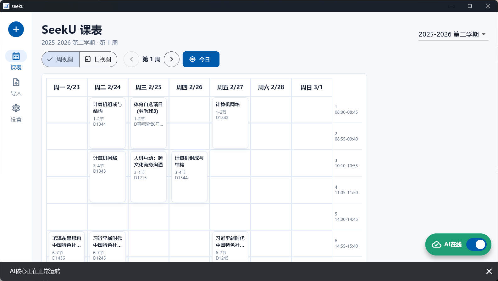
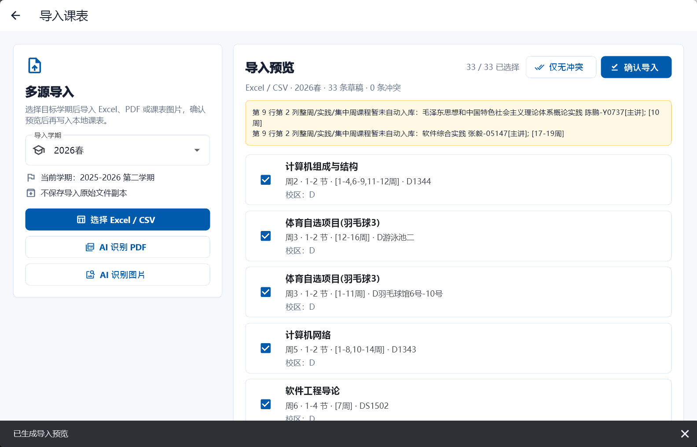
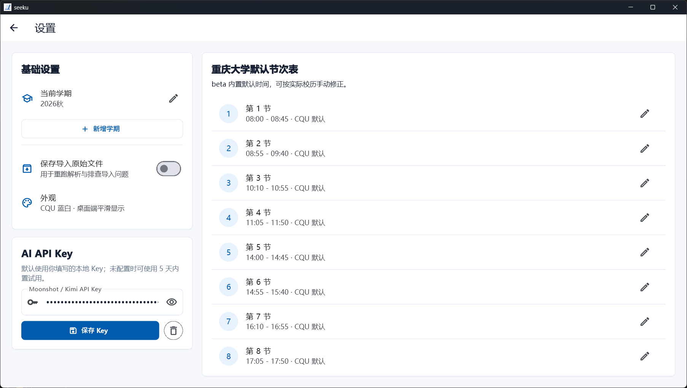

# SeekU 📚✨

[](https://flutter.dev/)
[](https://dart.dev/)
[](pubspec.yaml)
[](LICENSE)

> 面向重庆大学学生的本地课表、导入预览与 AI 结构化识别助手。<br>
> A Windows-first Flutter schedule assistant for Chongqing University students.

## 目录 / Table of Contents

- [中文 README](#中文-readme)
- [English README](#english-readme)

---

# 中文 README

## 项目简介

SeekU 是一个基于 Flutter 的课表管理应用，面向重庆大学学生的真实使用场景设计。当前阶段聚焦 Windows 桌面端：本地学期管理、课程查看与编辑、Excel / CSV 导入、AI 识别 PDF 或图片课表、导入预览确认，以及离线持久化。

它不是“把课表塞进数据库”这么简单。SeekU 更关心的是：导入前能看清、导入时能校验、导入后能修改，遇到 AI 识别也不盲信模型输出。

## 界面预览

### 主页



### 导入课表



### 设置



## 当前版本

当前版本：`v0.1.0-rc.2`（pubspec: `0.1.0-rc.2+6`）

这一阶段已经完成：

- 🗓️ 周视图 / 日视图课表展示，启动后默认定位到今日所在教学周的周视图。
- 🏫 多学期本地存储，课程数据基于 SQLite 持久化。
- ✍️ 手动新增、编辑、查看和删除课程。
- 📥 Excel / CSV 导入，带右侧预览、字段校验、冲突提示和确认保存。
- 🤖 AI 识别 PDF / 图片课表的初步接入，解析结果同样进入预览流程。
- 🔑 设置页支持用户自行填写并本地保存 AI API Key。
- 🧭 主页面右下角 AI 核心状态按钮，可检查当前 AI 连接状态。
- 🎨 设置页支持节次数量、非本周课程显示、节次时间、课程颜色、主题色、语言占位和字体大小调整。
- 🧪 已覆盖导入解析、AI JSON 解析、数据库行为、课表规则和基础 Widget 测试。
- 🪟 桌面端自定义标题栏、系统托盘入口和新版设置页。
- 📄 设置页可查看关于、用户协议、联系方式与开源协议；首次启动会要求确认用户协议。

仍处于实验阶段：

- AI 导入质量依赖上游模型、网络状态和课表文件清晰度。
- PDF 识别当前优先使用 Kimi 文件解析能力，尚未引入稳定的本地 OCR / 渲染兜底。
- API Key 当前保存在本地偏好设置中，后续应迁移到更安全的本地密钥存储方案。

## 功能亮点

- **今日所在周优先**：进入首页后默认展示今日所在教学周的周视图，并保留一键回到今日。
- **多源导入**：支持 Excel、CSV，并初步接入 PDF / 图片 AI 识别。
- **预览优先**：任何自动导入结果都不会直接写入正式课表，必须先确认。
- **本地规则兜底**：AI 返回的数据会经过本地解析、校验和冲突检测。
- **教室校区推断**：导入课程时，若教室字符串首个字符为英文字母，则自动作为校区字段，例如 `D1344` -> `D`。
- **面向后续扩展的 AI 核心**：当前接入 Moonshot / Kimi，结构上预留更多提供商和更多 AI 用途。
- **离线优先**：核心课表数据保存在本地，AI 能力是增强功能而非硬依赖。
- **本地可配置外观**：支持主题色、字体大小、课程颜色和显示节次数量等常用偏好。

## 用户下载

普通用户无需自行构建。推荐从 GitHub Releases 下载 Windows 安装包：

1. 打开 [SeekU Releases](https://github.com/Tokiperson/seeku/releases)。
2. 选择 `Latest` 或目标版本，例如 `v0.1.0-rc.2`。
3. 下载 `SeekU-v0.1.0-rc.2-setup.exe`。
4. 运行安装包，根据向导完成安装；如需桌面快捷方式，可在安装过程中勾选对应选项。

如果 Releases 中暂未看到目标安装包，说明该版本安装包可能仍在发布准备中；开发者可按下方“快速开始”从源码运行或构建。

## 快速开始

### 环境要求

- Flutter SDK，Dart 版本范围：`>=3.8.0 <4.0.0`
- Windows 桌面开发环境
- Windows 可用的 SQLite 运行时

### 安装依赖与检查

```powershell
flutter pub get
flutter analyze
flutter test
```

### 启动 Windows 桌面端

```powershell
flutter run -d windows
```

### 构建与发布 Windows 安装包

发布前建议从干净构建开始，避免夹带开发期构建缓存：

```powershell
flutter clean
flutter pub get
$hash = git rev-parse --short HEAD
flutter build windows --release --dart-define=SEEKU_GIT_HASH=$hash
```

Windows release 产物位于：

```text
build\windows\x64\runner\Release
```

项目提供 Inno Setup 脚本：

```text
installer\seeku.iss
installer\seeku-v0.1.0-rc.2.iss
```

手动构建后，可用 Inno Setup Compiler 打开对应 `.iss` 脚本并 Compile，或使用命令行：

```powershell
& "C:\Program Files (x86)\Inno Setup 6\ISCC.exe" installer\seeku-v0.1.0-rc.2.iss
```

安装包默认输出到：

```text
dist\inno\SeekU-v0.1.0-rc.2-setup.exe
```

`dist/`、安装器临时输出、签名私钥和本地 SQLite 数据文件均不应提交到 Git。

项目通过 native-assets hook 使用系统 SQLite：

```yaml
hooks:
  user_defines:
    sqlite3:
      source: system
      name_windows: winsqlite3
```

如果 Windows SQLite 环境缺失或配置异常，应用可能会在界面出现前启动失败。

## AI 配置

SeekU 不依赖 AI 也可以管理本地课表。若需要使用 AI 识别导入：

1. 打开 **设置** 页面。
2. 填写 Moonshot / Kimi API Key。
3. 保存到本地。
4. 回到主页，通过右下角 AI 状态按钮检查连接。

当前规则：

- 用户配置了 API Key 时，优先使用用户配置并在启动时自动检测连接。
- 未配置 API Key 时，每次启动软件只弹窗提醒一次。
- 内置试用 Key 只允许从首次打开软件起 5 天内使用。
- 超过 5 天后，AI 功能必须使用用户自行配置的 API Key。
- AI 操作完成后会弹出状态提示，用户可以手动关闭。
- AI 输出不会直接保存为正式课程，必须经过预览确认。

安全提示：当前 API Key 的本地保存方案仍偏开发期便利性，不适合作为长期安全设计。请不要把真实 API Key、个人课表截图或私密数据提交到仓库。

## 导入流程

所有自动导入都遵循同一条链路：

```text
源文件
→ 可选原始快照
→ Excel / CSV 解析器或 AI 解析器
→ CourseDraft[]
→ 字段校验
→ 冲突检测
→ 用户预览确认
→ 写入本地课表
```

当前支持情况：

| 来源 | 状态 | 说明 |
| --- | --- | --- |
| Excel `.xlsx` | ✅ 可用 | 支持当前脱敏 CQU 样例矩阵格式。 |
| CSV `.csv` | ✅ 可用 | 可处理部分星期列偏移场景。 |
| 旧版 Excel `.xls` | ⚠️ 可识别 | 建议转换为 `.xlsx` 或 `.csv` 后导入。 |
| PDF | 🧪 实验性 | 通过 Kimi 文件解析与结构化 JSON 输出接入。 |
| 图片 `.png/.jpg/.jpeg/.webp` | 🧪 实验性 | 通过视觉模型输入与结构化 JSON 输出接入。 |
| 教务网页 | 🚧 计划中 | WebView / DOM 捕获仍在规划。 |

## 项目结构

```text
lib/
  app/                 # 应用壳、路由、主题
  core/                # 数据库、Provider、设置、通用规则
  features/
    ai/                # AI 核心状态、API 客户端、Prompt、JSON 解析
    excel_import/      # Excel / CSV 课表解析器
    import/            # 导入领域模型、仓库、预览页面
    schedule/          # 周视图、日视图、课程详情、课程表单
    settings/          # 应用设置、学期设置、API Key 设置
```

值得关注的文件：

- [`docs/planningMap.md`](docs/planningMap.md)：项目路线图与阶段规划。
- [`lib/features/import/domain/import_models.dart`](lib/features/import/domain/import_models.dart)：导入草稿、校验、冲突与校区推断规则。
- [`lib/features/ai/data/moonshot_api_client.dart`](lib/features/ai/data/moonshot_api_client.dart)：Moonshot / Kimi API 接入。
- [`lib/features/import/presentation/import_page.dart`](lib/features/import/presentation/import_page.dart)：多源导入界面。
- [`lib/features/settings/presentation/settings_page.dart`](lib/features/settings/presentation/settings_page.dart)：设置、学期与 AI Key 配置入口。

## 路线图

### v0.1 本地课表闭环

- 完善多学期管理体验。
- 优化导入预览中的错误项修正能力。
- 收集更多脱敏 CQU Excel / PDF / 图片样例。
- 加强整周课程、实践课程、特殊周次表达的解析能力。
- 增加教务网页导入能力。
- 继续打磨 Android 窄屏布局，为后续移动端发布做准备。

### v0.2 AI 与资源层

- 完善 AI 请求日志、重试策略、错误分类和进度状态。
- 将 API Key 保存迁移到更安全的本地存储。
- 增加更稳定的 PDF / 图片处理策略，包括本地渲染或 OCR 兜底。
- 开始接入 CQU-Openlib 资源关联与摘要展示。

### 更远一些

- 账号与配置迁移。
- 云同步与冲突解决。
- 更完整的移动端适配。

持续更新的规划见 [`docs/planningMap.md`](docs/planningMap.md)。

## 开发规范

- 优先沿用现有 feature 目录、领域模型和 Provider 组织方式。
- 自动导入结果必须经过预览确认，不能绕过确认直接写入。
- AI 输出视为不可信草稿，需要经过本地校验和冲突检测。
- 不要提交真实 API Key、个人课表、原始截图或私密数据。
- `log/`、`AIUsage/`、`trash/` 是本地协作目录，默认不进入 Git。
- `dist/` 是本地安装包输出目录，`*.sqlite` / `*.db` 是运行期数据，不能提交。
- 若需要移除文件，项目规范要求先移动到 `trash/`，不要直接删除。

## 测试

运行全部测试：

```powershell
flutter test
```

当前重点测试范围：

- 课表网格模型与课程规则
- 数据库存储行为
- Excel / CSV 导入解析变体
- AI JSON 解析
- AI 设置与试用窗口逻辑
- Windows / Android 基础 Widget 冒烟测试

## 参与贡献

欢迎以小步、清晰、可验证的方式参与 SeekU。

建议流程：

1. 先提出 Issue 或任务说明。
2. 每次变更聚焦一个功能或一个 Bug。
3. 涉及解析器、仓库或 UI 行为时，同步补充测试。
4. 提交前运行 `flutter analyze` 和 `flutter test`。
5. 不要在提交中包含密钥、私密课表或个人截图。

## 开源协议

SeekU 使用 [Apache License 2.0](LICENSE) 开源。

## 致谢

- 使用 [Flutter](https://flutter.dev/) 与 [Dart](https://dart.dev/) 构建。
- 状态管理基于 [Riverpod](https://riverpod.dev/)。
- 路由基于 [go_router](https://pub.dev/packages/go_router)。
- 本地持久化基于 Drift / SQLite。
- AI 导入原型面向 [Moonshot / Kimi](https://platform.moonshot.cn/) 兼容 API。

SeekU 不是重庆大学官方产品。它是一个面向学生使用场景的开源工具，请在导入和保存个人课表数据时保持谨慎。

---

# English README

## Overview

SeekU is a Flutter schedule assistant designed around real Chongqing University student workflows. The current build is Windows-first and focuses on a reliable local loop: semester management, schedule viewing and editing, Excel / CSV import, AI-assisted PDF or image recognition, preview confirmation, and offline persistence.

The goal is not just to store courses. SeekU tries to make schedule data understandable before import, validated during import, and editable after import. AI output is treated as helpful draft data, not as truth.

## Screenshots

### Home


### Schedule Import


### Settings


## Current Release

Current version: `v0.1.0-rc.2` (pubspec: `0.1.0-rc.2+6`)

Implemented in this release candidate:

- 🗓️ Week and day schedule views using CQU-style teaching sections, opening by default on the current teaching week.
- 🏫 Multi-semester local storage backed by SQLite.
- ✍️ Manual course create, edit, detail, and delete flows.
- 📥 Excel / CSV import with preview, validation, conflict detection, and confirm-to-save.
- 🤖 Experimental AI import for PDF and schedule images.
- 🔑 Local user-provided AI API Key settings.
- 🧭 AI core status button on the home screen.
- 🎨 Settings for visible section count, off-week course display, time slots, course colors, theme color, language placeholder, and font size.
- 🧪 Regression tests for import parsing, AI JSON parsing, database behavior, schedule rules, and core widgets.
- 🪟 Custom desktop title bar, Windows tray entry, and redesigned settings page.
- 📄 Settings readers for About, User Agreement, Contact, and License; first launch requires agreement acceptance.

Still experimental:

- AI import quality depends on the upstream model, network conditions, and source-file clarity.
- PDF import currently prioritizes Kimi file extraction instead of a full local OCR/rendering pipeline.
- API Keys are currently stored in local preferences and should move to secure local storage later.

## Highlights

- **Current-week first**: the home page opens on the current teaching week by default and keeps a quick return-to-today action.
- **Multi-source import**: Excel, CSV, and early PDF/image AI recognition.
- **Preview-first workflow**: automatic imports never write directly into the final schedule.
- **Local validation**: AI-generated content still passes through local parsing, validation, and conflict detection.
- **Campus inference**: imported classroom text such as `D1344` infers `campus = D` from the first English character.
- **Extensible AI core**: Moonshot / Kimi is the first provider, with room for more providers and AI use cases.
- **Offline-first schedule data**: AI is an enhancement, not a hard dependency for local course management.
- **Configurable local UI**: theme color, font scale, course colors, and visible section count are locally adjustable.

## Download

Most users do not need to build from source. Download the Windows installer from GitHub Releases:

1. Open [SeekU Releases](https://github.com/Tokiperson/seeku/releases).
2. Choose `Latest` or a specific version such as `v0.1.0-rc.2`.
3. Download `SeekU-v0.1.0-rc.2-setup.exe`.
4. Run the installer and follow the wizard. Enable the desktop shortcut task if you want one.

If the target installer is not visible in Releases yet, the package may still be in release preparation. Developers can use the Quick Start section below to run or build from source.

## Quick Start

### Requirements

- Flutter SDK with Dart `>=3.8.0 <4.0.0`
- Windows desktop development environment
- SQLite runtime available on Windows

### Install and Check

```powershell
flutter pub get
flutter analyze
flutter test
```

### Run on Windows

```powershell
flutter run -d windows
```

### Build and Package for Windows

Start release packaging from a clean build to avoid carrying development artifacts:

```powershell
flutter clean
flutter pub get
$hash = git rev-parse --short HEAD
flutter build windows --release --dart-define=SEEKU_GIT_HASH=$hash
```

The Windows release files are generated at:

```text
build\windows\x64\runner\Release
```

The Inno Setup script lives at:

```text
installer\seeku.iss
installer\seeku-v0.1.0-rc.2.iss
```

After the manual Flutter build, open the matching `.iss` script with Inno Setup Compiler and compile, or run:

```powershell
& "C:\Program Files (x86)\Inno Setup 6\ISCC.exe" installer\seeku-v0.1.0-rc.2.iss
```

The installer is generated by default at:

```text
dist\inno\SeekU-v0.1.0-rc.2-setup.exe
```

`dist/`, installer temporary outputs, signing private keys, and local SQLite runtime data must not be committed.

The project uses a native-assets hook for SQLite:

```yaml
hooks:
  user_defines:
    sqlite3:
      source: system
      name_windows: winsqlite3
```

If Windows SQLite is missing or misconfigured, the desktop app may fail before the UI appears.

## AI Setup

SeekU can manage local schedules without AI. To use AI recognition import:

1. Open **Settings**.
2. Enter a Moonshot / Kimi API Key.
3. Save it locally.
4. Return to the home page and use the lower-right AI status button to check connectivity.

Current behavior:

- If a user API Key is configured, SeekU uses it first and runs a startup connection check.
- If no key is configured, SeekU shows at most one configuration dialog per app startup.
- The built-in trial key path is allowed only within 5 days from the first app open.
- After 5 days, AI features require a user-provided API Key.
- AI actions show a small status dialog after execution, which the user can dismiss.
- AI output must pass through preview confirmation before saving.

Security note: current API Key persistence is convenient for early development but is not a long-term secure-secret design. Do not commit real API Keys, private schedules, or personal screenshots.

## Import Flow

All automatic imports use the same local pipeline:

```text
Source file
→ optional raw snapshot
→ Excel / CSV parser or AI parser
→ CourseDraft[]
→ validation
→ conflict detection
→ user preview
→ confirmed local save
```

Supported sources today:

| Source | Status | Notes |
| --- | --- | --- |
| Excel `.xlsx` | ✅ Working | Parses the current desensitized CQU matrix sample. |
| CSV `.csv` | ✅ Working | Useful for some shifted weekday-column variants. |
| Legacy Excel `.xls` | ⚠️ Detected | Convert to `.xlsx` or `.csv` before import. |
| PDF | 🧪 Experimental | Uses Kimi file extraction and structured JSON output. |
| Image `.png/.jpg/.jpeg/.webp` | 🧪 Experimental | Uses visual model input and structured JSON output. |
| Teaching web page | 🚧 Planned | WebView / DOM capture is still planned. |

## Project Structure

```text
lib/
  app/                 # App shell, router, theme
  core/                # Database, providers, settings, shared rules
  features/
    ai/                # AI core status, API client, prompt, JSON parser
    excel_import/      # Excel / CSV schedule parser
    import/            # Import domain models, repository, preview page
    schedule/          # Week view, day view, detail page, course form
    settings/          # App settings, semester setup, API Key settings
```

Useful entry points:

- [`docs/planningMap.md`](docs/planningMap.md): roadmap and planning map.
- [`lib/features/import/domain/import_models.dart`](lib/features/import/domain/import_models.dart): import drafts, validation, conflicts, and campus inference.
- [`lib/features/ai/data/moonshot_api_client.dart`](lib/features/ai/data/moonshot_api_client.dart): Moonshot / Kimi API integration.
- [`lib/features/import/presentation/import_page.dart`](lib/features/import/presentation/import_page.dart): multi-source import UI.
- [`lib/features/settings/presentation/settings_page.dart`](lib/features/settings/presentation/settings_page.dart): settings, semesters, and AI Key entry point.

## Roadmap

### v0.1 Local Schedule Loop

- Improve the multi-semester management UX.
- Make failed import items easier to review and correct.
- Collect more desensitized CQU Excel, PDF, and image samples.
- Harden parsing for whole-week courses, practice courses, and special week expressions.
- Add teaching-web import support.
- Continue polishing narrow-screen layouts before a future mobile release.

### v0.2 AI and Resource Layer

- Improve AI request logs, retry strategy, error categories, and progress states.
- Migrate API Key storage to secure local storage.
- Add stronger PDF/image handling, possibly with local rendering or OCR fallback.
- Start CQU-Openlib resource linking and summary display.

### Later

- Account system and configuration migration.
- Cloud sync and conflict resolution.
- Better mobile adaptation.

The living roadmap is maintained in [`docs/planningMap.md`](docs/planningMap.md).

## Development Notes

- Prefer existing feature folders, domain models, and provider patterns.
- Imported results must not bypass preview confirmation.
- AI output is untrusted draft data and must go through local validation.
- Do not commit real API Keys, raw private course data, or personal screenshots.
- `log/`, `AIUsage/`, and `trash/` are local collaboration folders and are ignored by Git.
- `dist/` contains local installer outputs, while `*.sqlite` / `*.db` are runtime data and must not be committed.
- If a file must be removed, project rules require moving it to `trash/` first instead of deleting it directly.

## Testing

Run all tests:

```powershell
flutter test
```

Current test focus areas:

- Schedule grid models and course rules
- Database storage behavior
- Excel / CSV import parser variants
- AI JSON parser behavior
- AI settings and trial-window logic
- Windows and Android widget smoke tests

## Contributing

Contributions are welcome when they are small, focused, and easy to verify.

Recommended flow:

1. Open or discuss an issue/task first.
2. Keep each change focused on one feature or bug fix.
3. Add or update tests for parser, repository, or UI behavior when applicable.
4. Run `flutter analyze` and `flutter test` before submitting.
5. Never include secrets, private API Keys, or personal schedule data in commits.

## License

SeekU is licensed under the [Apache License 2.0](LICENSE).

## Acknowledgements

- Built with [Flutter](https://flutter.dev/) and [Dart](https://dart.dev/).
- State management by [Riverpod](https://riverpod.dev/).
- Routing by [go_router](https://pub.dev/packages/go_router).
- Local persistence powered by Drift / SQLite.
- AI import prototype targets [Moonshot / Kimi](https://platform.moonshot.cn/) compatible APIs.

SeekU is not an official Chongqing University product. It is a student-oriented open-source tool and should be used with care when importing or storing personal schedule data.
